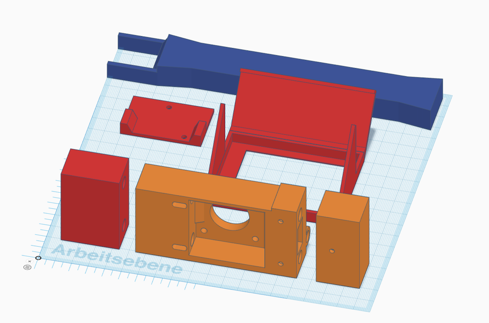
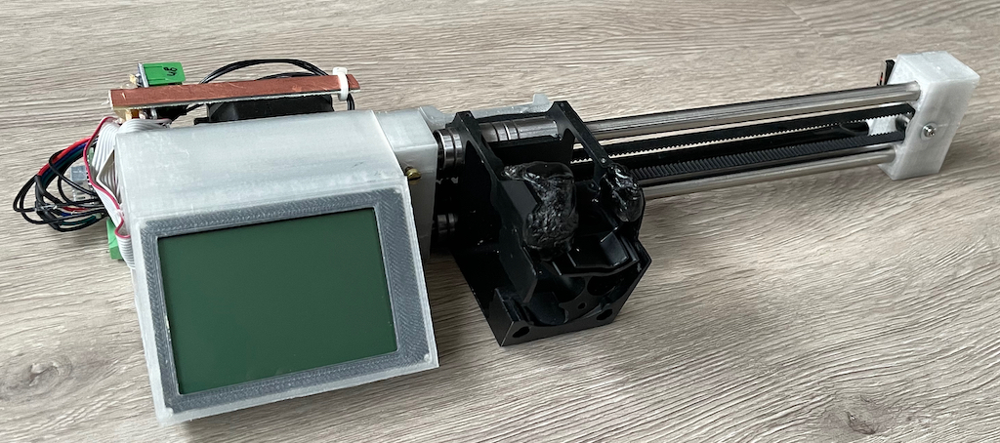
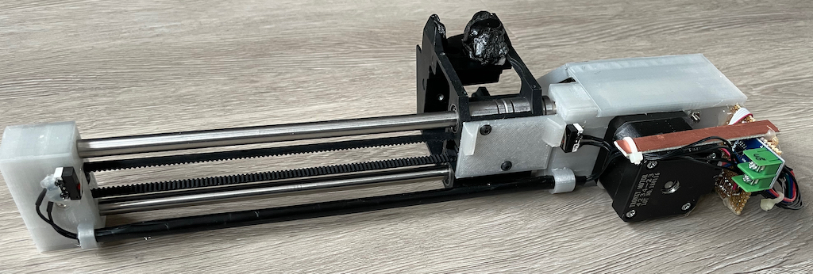
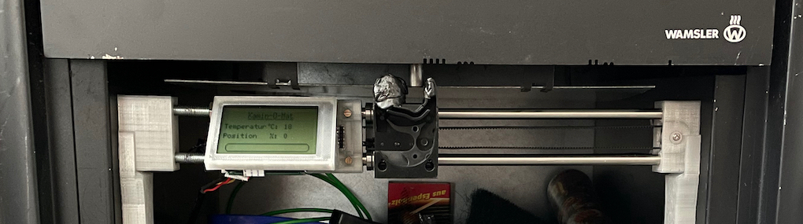

# HB-OU-AF-SEN-TEMP

Homematic AirFlap Control with Temperature Sensor - Kamin-Luftklappensteuerung mit Temperatursensor (MAX6675) im Rauchrohr 
_benötigt [JP-HB-Devices Addon Version 4.2 oder höher](https://github.com/jp112sdl/JP-HB-Devices-addon/releases)_
 
😤 Ich war es leid, zum Regulieren der Luftzufuhr des Kamins jedes Mal aufstehen zu müssen. 
💡 Eine Automatisierung musste her!  
Wie gut, dass ich erst kürzlich einen defekten 3D Drucker zerlegt hatte, der als idealer Ersatzteilspender diente. 
So hatte ich einen NEMA17 Stepper Motor, Linearführung, Umlenkrolle etc. sofort zur Verfügung. 
Der zerlegte Extruder passte auch mit leichten Anpassungen wunderbar unter den "Luftklappen-Nupsi" 😂 der Kamintür. 
 
Die nun noch benötigten Teile habe ich komplett auf Tinkercad konstruiert  
 
und anschließend - wegen der besseren Temperaturbeständigkeit - mit **PETG** gedruckt.

Die Elektronik: 
Aus meinem [Funkgeräte-Bedienteil-Recycling](https://homematic-forum.de/forum/viewtopic.php?f=76&t=61693&p=610949#p610949) war noch jede Menge übrig, so dass ich mich in erster Linie daran bediente. 
Im Detail habe ich verwendet: 
- ATmega128 AVR mit 14MHz ext. Quarz
- TM12864 LCD Display
- A4988 Stepper Motor Driver
- MAX6675 K-Typ Temperatursensor
- 2 Microschalter als End-Stopps
- CC1101 Funkmodul 868MHz

Verbaut am Kamin:

Steuerung über Homematic:

Higher Quality Video: [click here](https://github.com/jp112sdl/HB-OU-AF-SEN-TEMP/raw/master/Images/IMG_2086.mov)
  
